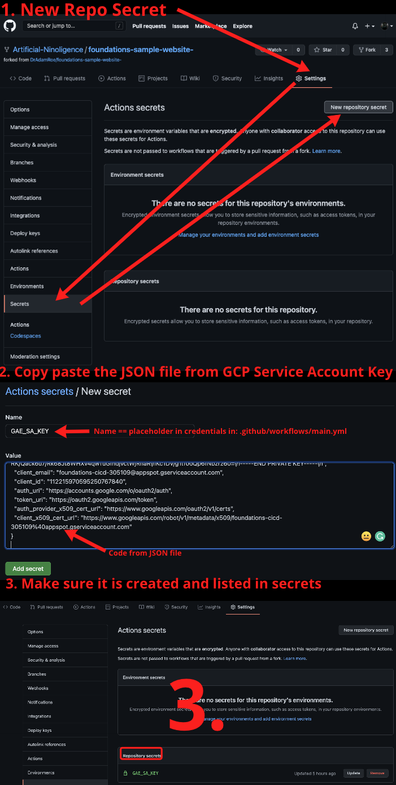

# Foundations of Software Engineering
This repository provides a starting point for students participating in the Foundations course at CODE University.

## Table Of Contents
1. [Get Started: Run A Website on Your Own Computer](#get-started)
1. [Hello, Flask!: Edit a Website Running Flask and Push it to GitHub](#hello-flask!)
1. [Deploying Your Website, automatically. ](#deploying-your-website)
1. [Troubleshooting common issues](#get-started)
## Get Started
This section will help you make the code yours and get it onto your computer, and check that you are ready to go. By the end of this section, you will be running the "Hello, World!" website on your own comptuer.

### Before You Start...

To use this repository, you need to have:
- basic working knowledge of Python, git, and the terminal
- a terminal running on your own computer which gives access to a linux-like command line
- Python 3.8 Installed and running
- An account on GitHub

### Fork (copy) this Repository (code) to your GitHub account
 Students of the class should begin by forking this repository so that it is in their own GitHub repository. Forking is like making a copy, but fancier. [Here are GitHub's instructions](https://guides.github.com/activities/forking/).

Before continuing, make sure that this repository has _your_ username in the URL, not Adam's or anyone else's.

### Clone (download) your repository (code) to your computer
On your own computer:
- Create a new folder, with a name like "foundations". That's up to you. e.g. `mkdir foundations`
- change directory into that new folder, e.g. `cd foundations`
- clone (like downloading, but fancier) _your_ forked repository from GitHub onto your own computer, e.g. `git clone https://github.com/<Best_Username_EVer>/foundations-sample-website-.git`

Now you should have your own fork (copy) of the foundations repository (folder) cloned (downloaded) onto your own computer.

### Before you continue: check your version of python

Make sure that you are using a version of Python which is relatively new, at least version 3.8. You can check this by using the command `python --version` at the command line. You can also a very fancy script by typing `python check_setup/version_check.py`.

You should see something like this:

If you see a longer message (`### oh no! ###`), you are using a version of Python which is too old. You will need to use Python 3.8 or newer. Like with all other software, you have to update the language itself from time to time.

Keep in mind that many computers have multiple versions of Python installed on them. It might be that you need to type `python`, `Python`, `python3`,`python3.8`, or something else, to get a version that you have already installed. Or you may need install it.

### Setup your local working virtual environment and install libraries
Change directory (`cd`) into the repository that you just cloned from GitHub. It will look something like this: 

You are now in the top level working directory of the Foundations repository. In order to use this, create a new virtual environment: 

 `python3 -m venv venv`

This will make a copy of the Python application - the programming language itself - in the directory you are working in. This allows you create something of a sandbox: the ability to run your code separately from anything else happening on your computer. As we write our own code and install code other people have written which is not a part of python itself, called libraries, this becomes more and more important to keep things running smoothly. 

After creating your new virtual environment (making a local copy of Python), you need to tell your terminal to use that new version of Python, instead of the one on your whole computer. To do this, we use the activate script: 

`source venv/bin/activate`

Depending on how your terminal is configured, you may see something like `(venv)` added to the prompt (the prompt is the part to the left of your cursor. It may show your directory or username, for instance). 

In order to check which version of Python your current terminal is configured to use, the command `which` comes in handy. It shows the path (location) of an executable (application) which is currently being used. Before activating the virtual environment, it will point to something which is system or user-wide. After activation, it will point to a path which contains your new working directory, specific to this project: 

Now we have our very own version of Python for this project which we can play around with. The Python language can do a lot, but not everything. It is common practice to develop a "library", which is additional code that can be installed to do more things with the language. You can think of it like a plugin for an application. Python is open-source, and there are many open-source libraries which we can install additionally. We will install a set of tools which are very helpful for web development, since that is what class focuses on (you can imagine that if the goal were to develop a desktop video game instead of a website, we would need other pieces of code, or libraries). 

To install the libraries we need, we will use the command `pip`. Pip is a tool to help us manage (install, check versions, etc..) the external python code we are installing. We could use the command pip and give it a specific package name, but that would be a lot of typing, hard to reproduce, and easy to make mistakes. We will use a file called `requirements.txt`, which lists the packages and their specific versions that we need. Have a look at that file now, sitting in the repository. This is a big step towards having a reproducible environment - which is a fancy way of saying that you have confidence that your software will continue to run. Because we are using the same versions of the same libraries on all students' computers and on the servers we will rent from Google Cloud later, we can be relatively confident that it works as expected. It happens all the time that someone updates a library that they maintain (adding a feature, for instance), which inadvertently breaks compatibility with another library that someone else maintains. We want to prevent that from happening, so we can use specific versions of third-party code, just like we will use specific versions of our own code using version control (git). To do install the third-party libraries, use the command

`pip install -r requirements.txt`

You should see a lot of output on the screen, and somewhere towards the bottom a message that says you have successfully installed, something like this: 

### Run the "Hello, World!" website on your own computer

At this point, you should finally be able to run the "hello, world!" website locally on your own computer. The command `uwsgi` will run a server. Try this command to start your server (e.g. run your website):

> uwsgi --http :8080 --wsgi-file hello_world/hello_world.py

If you see something like `uwsgi: command not found`, something is wrong with your _environment_ (the way the computer is setup), not the code itself. Make sure you have activated a virtual environment, are running python3.8 or newer, and have installed the libraries listed in requirements.txt, as described above.

This will run a super simple website, only accessible on your own computer. To see it, navigate to http://localhost:8080 in your browser. It should look like this:

If you haven't done so yet, this is a good time to open the file you are running, `hello_world/hello_world.py`. This is about as bare-bones as a web server can get.

These instructions are based on [the uwsgi documentation](https://uwsgi-docs.readthedocs.io/en/latest/WSGIquickstart.html). To learn more or troubleshoot, that is a good place to start.

## Hello, Flask!
In this section, you will learn how to edit and run a website using Flask locally using best practices, including testing, linting, and then pushing (uploading) to GitHub in the end.

### Run the sample website using Flask, locally.

Building on the previous example, we will use a framework for building websites called Flask. We will go into more details on what it is in class, and why it is useful.

Running a website using Flask using the same basic command, `uwsgi`, but requires a few more arguments:

`uwsgi --http-socket 127.0.0.1:8080 --wsgi-file sample_website/website.py --callable app --processes 4 --threads 2 --stats 127.0.0.1:8181 -H venv/`

You should now be able to go http://localhost:8080 in your browser and see the Hello, Flask! Website

This command starts a server (`uwsgi`), specifies which IP address and port to run on (`http-socket`), chooses which file to run off of (`wsgi-file`), specifies what the application itself is called (`app`, defined in the file you are running), specifies a second automatic site for statistics (`stats`), tells your computer what resources (think processing) this application requests in order to run well (`processes` and `threads`), and lastly, selects a version of Python (`-H`). Whew. For now, you don't need to think too much about all of this. We will work with the file and the socket a bit in the coming weeks in particular.

### Congratulations! You are Running Your First Website!

Alright, you've gotten the sample website running on your own computer with Flask. That is no small feat. You should be proud of yourself. Now we're going to take it up a notch.

### Edit The Website
If the website is running, turn it off (`Ctrl+C` in the terminal to quit. You need to turn the website off and on again, called reloading, to get changes.

Open `sample_website/website.py`, and greet in a different way. I've edited mine to greet myself, for instance. It now returns "Hello, Adam!". After starting the web server locally again, it shows this, too.

Alright! We are getting close to running by hand, on our computers, the things we did in the first week on Glitch. This is a good moment to open the browser inspector tools and play around with the HTML and CSS like we did on other live websites, too.

### Code Quality: Linting
As software grows in scale and complexity, the quality of the code itself becomes more and more important. Think about organizing your closet or cleaning a shared space like a kitchen or bathroom with roommates or family members. At some point, you need to agree on how you are going to do it, otherwise people get frustrated. There are many standards out there, and in practice, every language has its own best practices, and different organizations - or different teams within organizations - will do things differently. Thankfully, Python has a standard called PEP8, which we will do our best to adhere too. Read more about the standard, what is in it, and linting in general [here](https://realpython.com/python-pep8/), for instance.

We will use a tool called `flake8`to lint our code. It should already be installed via your `requirements.txt` file.

To lint your code, run:

> `flake8 --exclude venv`

If you see _no output at all_, it means everything is fine.

This may be a bit unsatisfying. We all want to be rewarded with a green success message for doing a good job, right? Think of this is an alarm system which is _not_ going off. That's a good thing!

If you want to see more under the hood, add the `--verbose` flag. This will show you what it is doing, and convince you that it is doing something.

> `flake8 --exclude venv --verbose`

By the way, the flag `--exclude` tells flake8 to ignore some directories. The `venv` directory contains the Python programming language itself, so linting that is basically saying "Did the authors of the Python language itself adhere to best-practices in writing the Code?". While perhaps quite interesting, it is not really relevant right now. And may take a long time. If you notice the tool slowing down over time, you may also want to exclude the `__pycache__` directory, which is generated by your computer when you run your software, to speed things up.

### Writing Better Code, the first time around
We don't want to wait for alarm to go off and tell us we are doing something wrong, we want the alarm to not go off in the first place, right? Now is the time to set up VSCode to help you write better (Python) Code.

Let's start with installing & enabling the Python extension. You may have it already. To check, go to _Extensions_ and search for Python. VSCode is open-source and anyone can add an extension to the marketplace. The number of stars and downloads gives you a hint about popularity and quality, which is a good place to start. We will use the top extension, from Microsoft (who is the main developer of VSCode itself, too.)

If you see something like this, it is installed already! you are good to go. Click on the settings cog to customize it.

Linting can also be enabled directly in the CODE editor. You will see yellow underlines for warnings and red underlines for errors. This gives you quick feedback as a developer, correcting errors quickly. [Enable and learn more about Linting in VSCode here](https://code.visualstudio.com/docs/python/linting).

When we deploy our websites to the internet in a few minutes, linting will run automatically on the cloud - so we want to make sure we have done it first on our own computers, too, to ensure that everything runs smoothly!

### Code Quality: Testing
Testing your code is essential in being confident that it will work. When you test code, you are asking _Does this thing work the way I want it to work?_. Like anything else, you want to make sure it works before you sleep comfortably. Software, however, is quite complex, so just looking at it quickly doesn't always mean it will always work. Think of a piece of software like a train or a car: there are thousands or millions of components working together to make it move forward. If a piece - maybe part of the engine, or a wheel, or the brakes - aren't working properly, you want to find that out as early as possible to fix it. You don't want to be left scratching your head thinking _This thing isn't moving forward and I have no idea why!_ The principle here is getting more feedback, quickly. In the world of software, the equivalent would be deploying a website and it going blank. Or worse yet: getting upset users loosing faith in your product because it doesn't always work well. Imagine that happening with a payment system on a website...

To test your `sample_website`, go into it's subdirectory (e.g. `cd sample_website`) and then run `pytest`, also installed already through your requirements file:

 `pytest --doctest-modules`

 Running this command, you should see something like this:

 

Wait! Red and Fail and Error is bad, right? Yes, you are correct. Have a look to see what is going on there. The test is checking for an HTML header that says Hello, _Flask_! while the code we have written says Hello, _Adam_!. You can find the test in the subdirectory `sample_website/tests/test_sample_website.py`. There it is, crystal clear: the test is expecting the function `hello_world()` to return a piece of HTML with an `h1` header and some specific text, and we went and edited that text.

There are a few ways to fix this, and you should ask yourself what you want to do. We are now getting into the fine art of writing tests: they need to be helpful and catch errors, without being too fragile. Before changing code, you should ask yourself what the goal is. Do you want to:
1. Always greet users with "Hello, Flask!" like in the original example?
1.  Always greet users with the new message you wrote, in this case, "Hello, Adam!"?
1. Write something more flexible, for instance, a piece of code which checks that there is an h1 HTML tag returned that starts with "Hello,", and what comes after doesn't matter, as long as it has more than 2 characters?

To learn a bit more about testing, start with option 2: change the test so that it matches the new html you have written. In more complex code, a flexible solution like described on option 3 could be better - but it is also not without difficulties to get it right.

Once you have updated the test itself, you should see something like this:

Now that we are able to update our code, lint it, test it, it is time to push (upload) that code to GitHub

### Push (upload) Your Changes to GitHub
By now, you have made a number of changes to files on your computer. You have definitely changed the code in the file `sample_website/website.py` to change the greeting, and the code in the file `sample_website/tests/test_sample_website.py` so that the test is updated to match, as well. Now it is time to push (upload) those changes to GitHub. There is a bit of confusion about the what and why here, so let's take a second to understand what is going on before hitting some random keys.

git is an extremely powerful open-source tool for collaboration, written in the early 2000's to aid in the process of developing Linux itself. It is a type of source code management (SCM) tool and version control system (VCS). Git has become the go-to open source tool of its kind, widely used in software development. It is not the first, the only, or the last of its kind - but the principles it embodies are here to stay, and it is the standard. You do not need to become an expert in git to use it, but you should become comfortable with it as a tool.

In order to use a tool like git to its full capabilities, you need something called a git server - and we will use GitHub for this. For now, you can think of this as the part that lives in the cloud. To understand what this is, let's think about writing normal text, not code. When you write something, like email, a note, or a doc, you probably are writing on an app on your own computer, but you are probably also syncing or backing it up to the cloud, using a service like Google Drive, Apple iCloud, Office 365, or Dropbox. This allows you to access the document you are working on on multiple devices, like your laptop and your phone, as well as share them via link with other people. For code, it's the same thing: you can write your code locally in VSCode (your code editor) and save it to your computer, but then it is not backed up, accessible on other computers to you, or shareable. This is where a git server like GitHub comes in: it is the equivalent of Drive, iCloud, or Dropbox. You can "push" your code from your own computer to GitHub, akin to uploading a file to a cloud storage service, making it accessible, and backing it up.

You may ask, then, why not just use one of the other services for your code instead of GitHub? Well, you can. It will work, but it won't be a good experience. These services are built for specific types of files, for instance, images and documents. In the same way, GitHub is built for code. You can do more with it, and do it better.

### Enough Talking, how do I push?

There are three commands needed

> git add <filename>
> git commit -m "message"
> git push

`git add` tells git "I want to save the changes I've made to this specific file". You can add multiple files, bundling the changes together. Think about the example where we changed one piece of code in two file: you want to those changes to stick together, even though they are in separate files.
`git commit` tells git "I'm done with the bundle". It adds a message, too, which is a note for you and your collaborators saying what the bundle is.
`git push` tells git "I'm ready. Upload to GitHub!"

In addition, the command `git status` can be very helpful to tell you about where you are in this process.

Once you have done this, you have successfully edited files on your own computer and updated them on GitHub! That is no small feat, congratulate yourself with something nice.

## Deploying Your Website

When we build a website, we usually want it to be on the internet for people to see. We will automatically deploy to Google Cloud's App Engine using GitHub Actions. Once this is fully configured, simply pushing to GitHub will a: 

On GitHub:
1. Add "Repository Secret": https://docs.github.com/en/free-pro-team@latest/actions/reference/encrypted-secrets

=======
- lint your code
- test your code 
- deploy your code 

This is already configured in the file `.github/workflows/main.yml`. I encourage you to have a look at it and try to understand what it is doing - some of these commands will look familiar, some will not. 

The full, step-by-step instructions for using GitHub Actions to deploy to google cloud can be found in the PDF located at `documentation/DeployToGCPfromGitHub.pdf`, or the [Miro Board from class](https://miro.com/app/board/o9J_lTxsze4=/). Note that step 7 is an optional, additional way to deploy. Once you have finished step 6, pushing to GitHub should automatically deploy to Google Cloud Platform (GCP). Be sure to get credits for GCP first, linked in the week's assignment. 

There are two additional files in your repository worth looking into right now: `main.py` and `app.yaml`, both used by GCP to configure your software - in other words, to know what to do. You will have to work with the file `main.py`: this imports one of the many websites (applications) from the repository. It allows us to have multiple websites in this repository, and then select the one we will run. It only needs one line of code, but that line is important! The file `app.yaml` specifies some settings for Google App Engine itself, for example, the version of Python and the size of the computer we want to use (F2). You shouldn't need to touch this file anytime soon. 

Once you are done, you should be able to edit code on your computer, then `git push` to GitHub, which will in turn test, lint, and deploy your code to Google Cloud, running it live on the internet! 

Note the URL of this page: this is live on the internet, not running locally on your own computer!

That's it, you're done setting it up! Continue with this week's assignment :)

## Troubleshooting

### Problems with uWSGI 
A number of issues came up in Spring '2021, both with M1 Macs and Windows. As an alternative to using uwsgi, you can test locally using Flask's built-in development server, using the command `flask run`. Note that you will have to set environment variables for this to work. See the documentation and [tutorials](https://flask.palletsprojects.com/en/1.1.x/quickstart/) for how to set this up. 